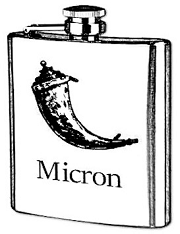

Flask-Micron
============

Introduction
------------

Flask-Micron is a method-oriented API framework for Python, focusing on
security and productivity. It is built on top of the excellent Flask
microframework.

The main goal for the project is to make it really simple for developers to
write microservice-style JSON webservices, honoring best practices for
security, and without having to pollute business logic code with HTTP
request handling knowledge.

Example code
------------

