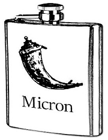

Welcome to Flask-Micron
=======================

Introduction
------------

Flask-Micron is a method-oriented API framework for Python, focusing on
security and productivity. It is built on top of the excellent `Flask`_
microframework.

The main goal for the project is to make it really simple for developers to
write microservice-style JSON webservices, honoring best practices for
security, and without having to pollute business logic code with HTTP
request handling knowledge.

Users Guide
-----------

.. toctree::
   :maxdepth: 2

   users_guide/installation
   users_guide/quickstart

Developers Guide
----------------

.. toctree::
   :maxdepth: 2

   developers_guide/setup

API Reference
-------------

.. toctree::
   :maxdepth: 2

Additional Notes
----------------

.. toctree::
   :maxdepth: 2

   additional/license
   additional/dependencies
   additional/history
   additional/why_that_name
